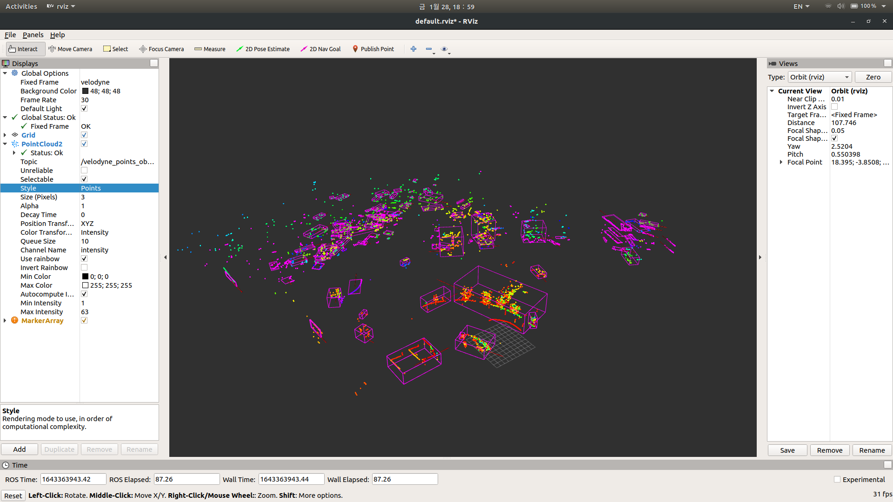
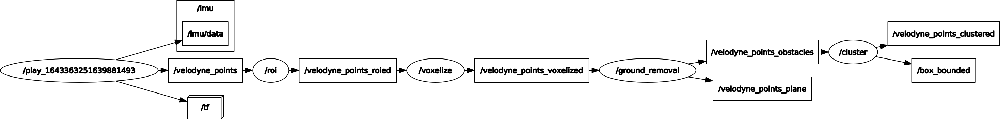

# ros_object_tracking
## Ros Packages for object(vehicles) tracking  

---
# Version
## OS
Ubuntu 18.04 LTS
## Ros
Ros1-Melodic

---

# Description
## Diagram

PCD data -> roi node -> voxelize node -> ground_removal node -> cluster node    

### <b><u>I separated every step into different nodes so it's easier to debug and understand the flow of data being processed. You could merge them into one node or do whatever you want!  </u></b>

## Topic
/velodyne_points  
/velodyne_points_roied  
/velodyne_points_voxelized  
/velodyne_points_obstacles && /velodyne_points_plane  
/velodyne_points_clustered  
/box_bounded

# <b><u>*****Note!</u></b>
## Things that should be fixed
### cluster node
- cluster node separates every cluster and pack them into a vector. But currently(2022-01-28) it only publishes the first element in the vector.
---
# How to Use
## First, you do
    cd ${your_workspace}/src    
    git clone https://github.com/Gonnnnn/Ros_Project.git

    Build Dependencies in order
    catkin_make --only-pkg-with-deps common_lib
    catkin_make --only-pkg-with-deps object_builders_lib
    catkin_make --only-pkg-with-deps my_pcl_tutorial

## Run
Activate roscore  

    roscore

You could either run each node
(roi -> voxelize -> ground_removal -> cluster)

        rosrun my_pcl_tutorial ${node_name}

Or launch a launch file

        roslaunch my_pcl_tutorial player.launch

Go to the directory where your rosbag files are and run your rosbag file

    cd ${directory_where_your_rosbag_files_are}
    rosbag play ${your_rosbag_file_name}

Check them out on rviz

    rviz

## If it doesn't work?
Pls lemme know if it doesn't work. It could not since I'm not really good at ROS and C++ yet

---

# Reference
## Official Document
https://pcl.readthedocs.io/en/latest/index.html  

## Blogs
https://limhyungtae.github.io/page2/  

https://saint-swithins-day.tistory.com/43?category=873762  

## Open Sources
https://github.com/LidarPerception/common_lib

https://github.com/LidarPerception/object_builders_lib

---

# Developer's note
## To-Do
- figure out how to publish every cluster