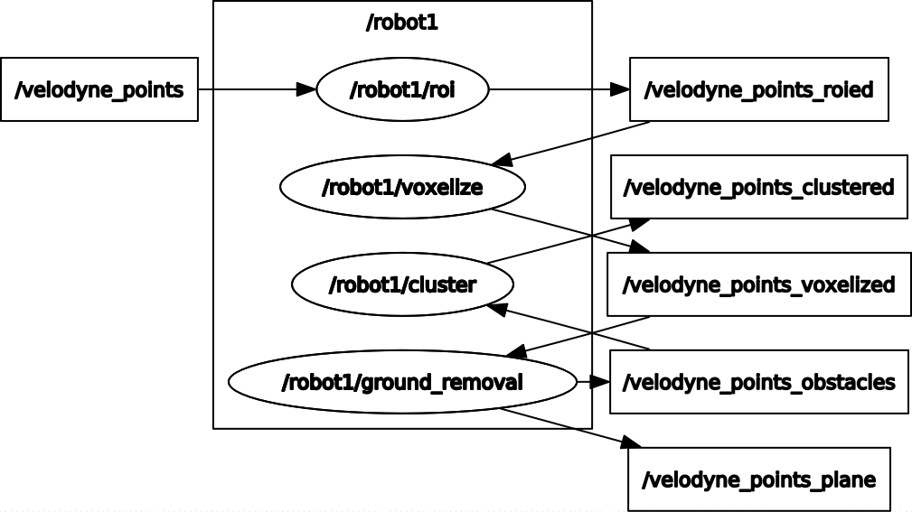

# ros_object_tracking
## Ros Packages for object(vehicles) tracking  
---
# Version
## OS
Ubuntu 18.04 LTS
## Ros
Ros1-Melodic

---

# Description
## Diagram

PCD data -> roi node -> voxelize node -> ground_removal node -> cluster node    

### <b><u>I separated every step into different nodes so it's easier to debug and understand the flow of data being processed. You could merge them into one node or do whatever you want!  </u></b>

## Topic
/velodyne_points  
/velodyne_points_roied  
/velodyne_points_voxelized  
/velodyne_points_obstacles && /velodyne_points_plane  
/velodyne_points_clustered  

# <b><u>*****Note!</u></b>
## Things that should be fixed
### cluster node
- bounding boxes and pose estimation are not implemented yet
- cluster node separates every cluster and pack them into a vector. But currently(2022-01-25) it only publishes the first element in the vector.
---
# How to Use
## First, you do
    git clone https://github.com/Gonnnnn/Ros_Project.git

And then move the "my_pcl_tutorial" to src directory under your workspace(commonly, it's ~/catkin_ws)  
After that, Build it!

## Run each node
Activate roscore  

    roscore

Run each node
roi -> voxelize -> ground_removal -> cluster

    rosrun my_pcl_tutorial ${node_name}

Go to the directory where your rosbag files are and run your rosbag file

    cd ${directory_where_your_rosbag_files_are}
    rosbag play ${your_rosbag_file_name}

Check them out on rviz

    rviz

## If it doesn't work?
welp.. :D

---

# Reference
## Official Document
https://pcl.readthedocs.io/en/latest/index.html  

## Blogs
https://limhyungtae.github.io/page2/  

https://saint-swithins-day.tistory.com/43?category=873762  

---

# Developer's note
## To-Do
- add boundiing boxes and pose estimation modules
- figure out how to publish every cluster